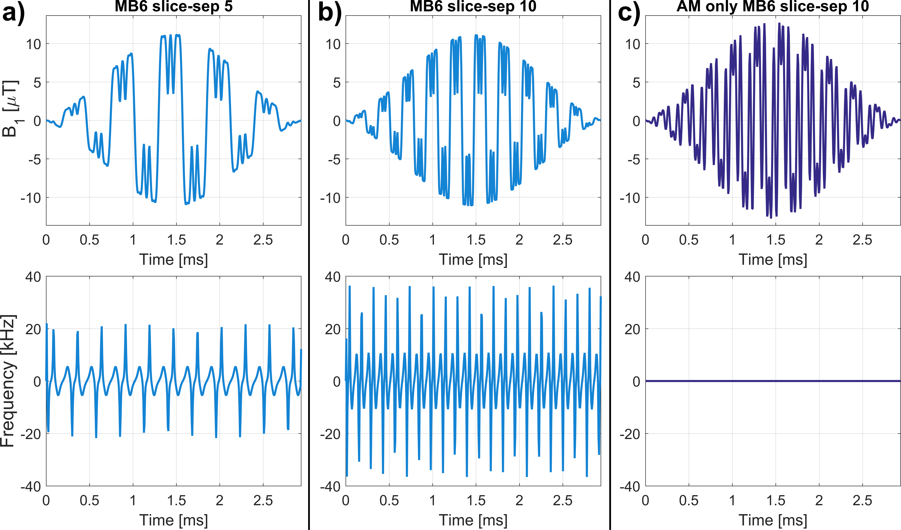
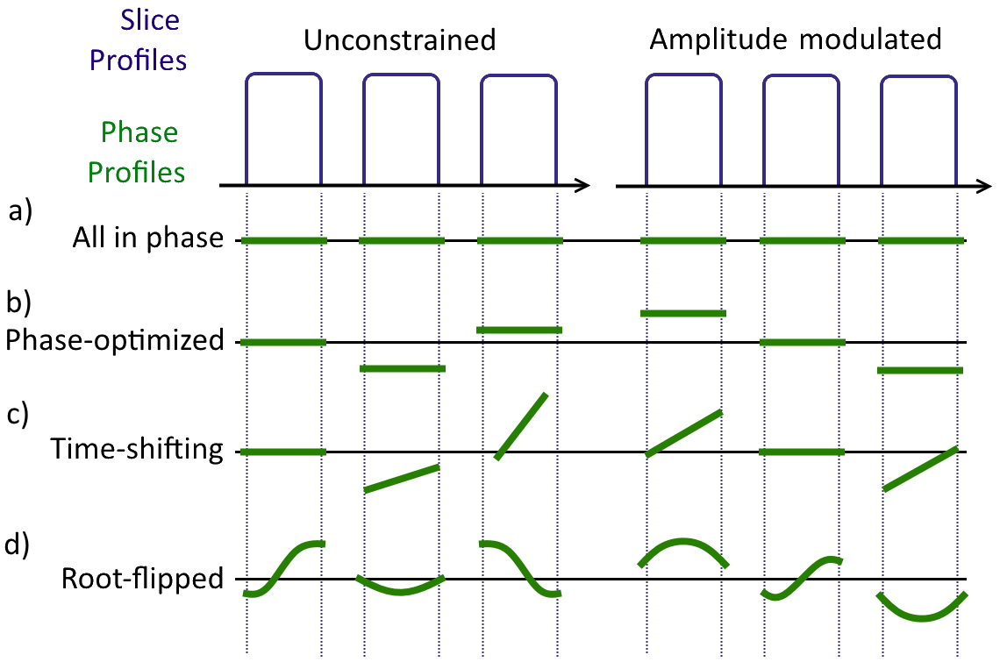
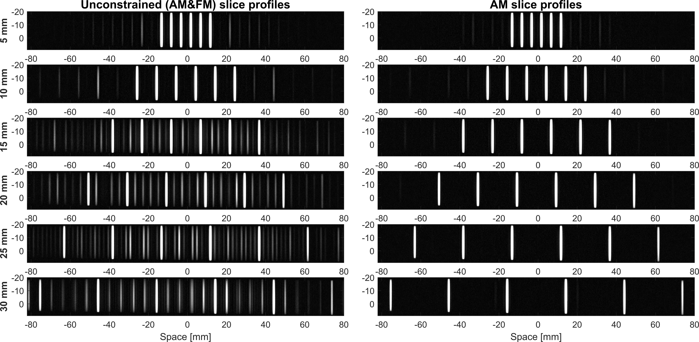
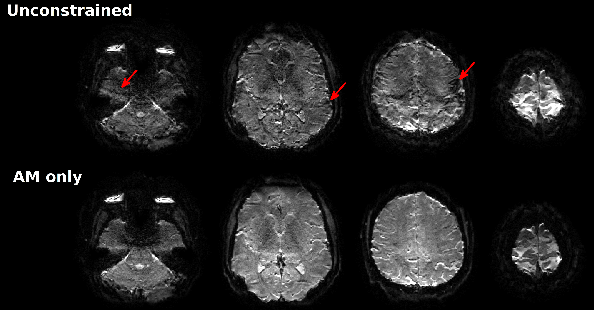
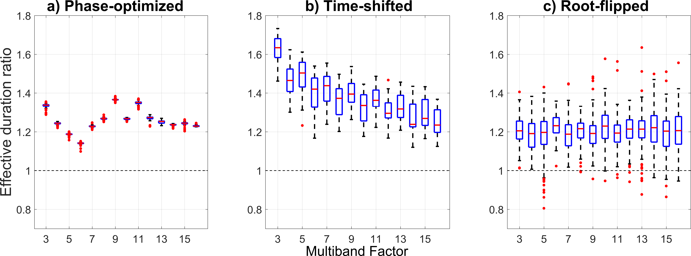

# Optimized amplitude modulated Multiband RF pulse design

Design AM Multiband pulses using modified versions of Phase-optimization (Wong 2012), Time-shifting (Auerbach 2013) and Root-flipping (Sharma 2016) to produce AM-only pulses.
Each pulse design method is contained within a folder with a main function (phaseopt_fn, timeshift_fn and rootflip_fn).
Running the script Design_Multiband.m designs Normal or AM-only pulses using the three methods and plots the RF pulses and slice profiles.

This requires the following:
*  CVX from (http://cvxr.com/cvx/).
*  Pauly's RF tools from (http://rsl.stanford.edu/research/software.html).

Update: this work has been published and is publicly available [**here**](http://onlinelibrary.wiley.com/doi/10.1002/mrm.26610/full) .

## Purpose
Multiband RF pulses can be demanding for the RF hardware used for clinical MRI. They are often optimized to have short pulse durations in order to reduce echo-times. Three published ways of doing this are:
* Phase-optimization (Wong ISMRM 2012)
* Time-shifting (Auerbach MRM 2013)
* Root-flipping (Sharma MRM 2016)

As a consequence of optimization, the RF pulses have both real and imaginary components, and are described by an amplitude modulation (AM) function and frequency modulation (FM) function.
We have found that when the FM-component is volatile, the RF chain fails to reproduce it in practice. 
To this end, we modified the above three RF pulse design techniques to design equivalent optimized Multiband RF pulses using only amplitude modulation (i.e. no imaginary components).

Here's an example of what that looks like for a multiband 6 RF pulse.

## Theory
To design optimized AM Multiband RF pulses we hypothesised that its frequency representation must be conjugate-symmetric. This is because real functions have Fourier transforms which are conjugate-symmetric. This implies that the desired Multiband slice profiles should consist of even magnitude profiles and odd phase profiles. An illustration of what this means for a Multiband 3 example is shown

## Results
Slice profile measurements at 3T using unconstrained and AM-only Multiband 6 pulses (Using the RF pulses the figure above).

Notice how the stop-band artefacts worsen with higher slice separations. This is because the rate of FM increases proportionally with the slice separation.

These artifacts manifest themselves as a mixture of blurring, signal leaking and reconstruction errors.

(MB4 Gradient-echo single-shot EPI)

Because AM-only pulses are more constrained, it's expected that they will be less efficient than their unconstrained  equivalents. This cost in duration (or equivalently, in an increase in B1-amplitude) was found to be:
* 26% for AM Phase-optimization
* 38% for AM time-shifting
* 20% for AM root-flipping

Here's a figure showing how for each method the duration cost varies across Multiband factors and slice-separations:

## Contact
13/01/2017

For contact
Samy Abo Seada
samy.abo_seada@kcl.ac.uk

Shaihan Malik
shaihan.malik@kcl.ac.uk
King's College London, 2016.