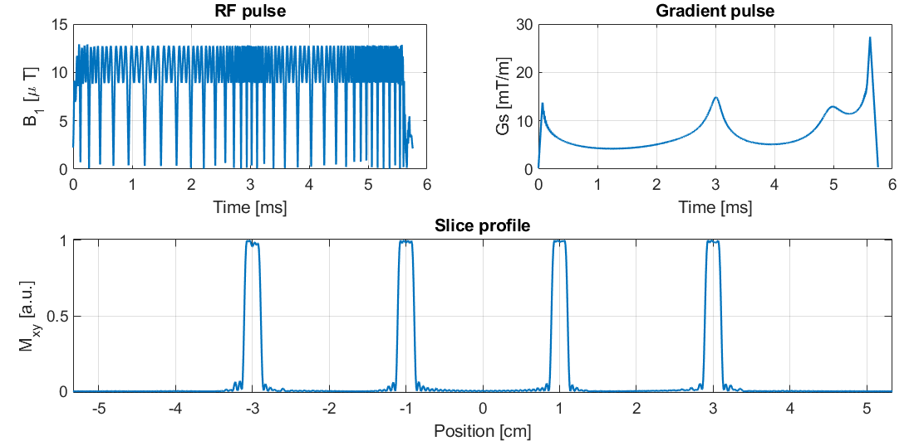
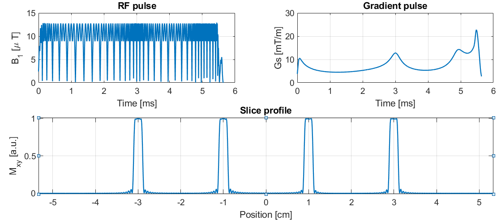
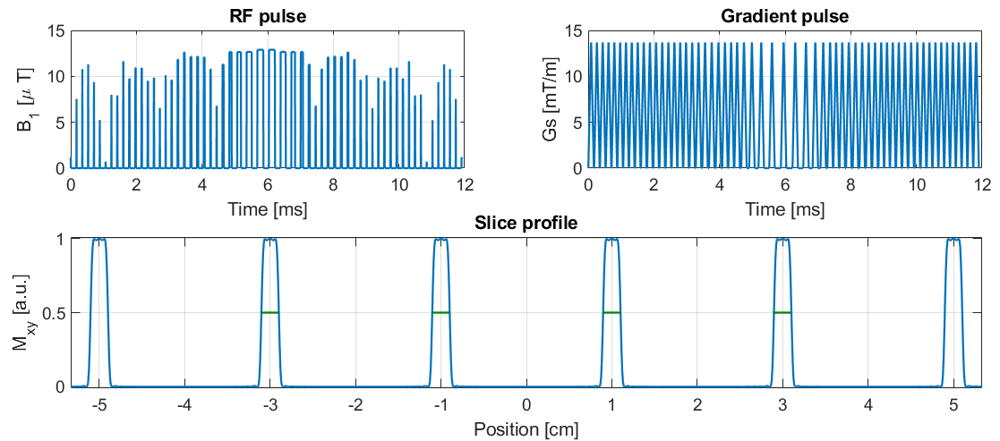

# Multiband RF toolbox
Design the following types of RF pulses:

Singleband pulses with the options:
* Linear-phase, minimum-phase, quadratic-phase
* Excitation, refocusing and matched-excitation refocusing
* Using Least-squares or CVX optimization

Multiband pulses:
* Phase-optimized (Wong ISMRM 2012)
* Time-shifted (Auerbach MRM 2013)
* Root-flipped (Sharma MRM 2015)
* VERSE-Multiband (Our work in Abo Seada MRM 2018)
* VERSE-Multiband with GIRF correction (Abo Seada ISMRM 2017)
* PINS (Norris MRM 2011)
* Multi-PINS (Eicher MRM 2014)


This code relies on the following repos:
* AM_multiband  (https://github.com/mriphysics/AM_multiband)
* verse-mb (https://github.com/mriphysics/verse-mb)

Both have already been incorporated in this repo, for convenience. At the time of writing they are exact copies.

PINS and Multi-PINS code has been further developed from Will Grissoms' repo: (https://bitbucket.org/wgrissom/lowpeakpowermbrf).

Also relies on
*  CVX from (http://cvxr.com/cvx/). 
*  Pauly's RF tools from (http://rsl.stanford.edu/research/software.html).


## Multiband examples
Open the script `dz_multiband_example.m` - all the variables which will affect your pulse design are in the top section.
First decide if you want to base your design on a existing RF pulse, or design a new RF pulse subject to your application.
```
% Basic configurations - Load or design a new base SB pulse?
Nt = 2048; %<-- set number of time-points
gamma_mT = 2*pi*4.257*1e4; %<--- same as in minTime gradient function
load_SB_pulse = 1;  %<-- set to 1 to use precalculated Single-band pulse
flip = 180*pi/180; %<-- set flip-angle.
```

### A usual multiband refocusing pulse (all in-phase, from precalculated RF).

If `load_SB_pulse` is 1, I have some tb2-10 refocusing pulses stored in 
`SB_SLR_cvxdesign_flip180_quad_Mar27`. If you have access to vendor RF pulses, they can be 
loaded in the same way - but you must specify the time-bandwidth product manually.

Then set `mb_type` to one of the multiband type pulses, the number of slices, time-bandwidth product (integer from 2-10), and slice separation.
```
%<-- Set what type of multiband pulse. Choose from
%    'no' : Non-optimized [Larkman 1991]
%    'po' : Phase-optimized [Hennig 1992, Wong 2013, Malik 2014]
%    'ts' : Time-shifting [ Auerbach MRM 2013]
%    'rf' : Root-flipping [Sharma MRM 2015]
%          The following four methods are described in Abo Seada MRM 2018
%    'mbv': Multiband (po) pulse followed by VERSE
%    'vmb': VERSE followed by multiband (Better for gradients!).
%    'mbvg' : Multiband VERSE pulse with GIRF-correction
%    'vmbg' : VERSE-multiband pulse with GIRF-correction (recommended..!)
%    'pins' : PINS pulses (Norris 2011)
%    'multipins' : MultiPINS pulses (Eichner 2014)

mb_type = 'no'; 
mb = 4; %<-- Number of slices (Multiband factor)
tb = 6; %<-- Time-bandwidth product.
bs = 10;%<-- band separation (in units of slice-thicknesses)
slthick = 2*1e-3; %<-- slice thickness [mm]
gradientslopes = 1; %<-- Set to 1 for sloping gradients at start and end.
```

Finally, there are some hardware parameters you can use. In this case the `b1max` is the most significant one as it
sets the peak B1 amplitude, and thus the RF pulse duration.
```
maxb1 = 13*1e-3; % <--- peak B1 [mT]
```

The result should look like this


### Quadratic phase matched-excitation VERSE multiband pulse with GIRF correction
My top pick for a MB spin-echo difussion sequence! 
First design a new RF pulse. Set `load_SB_pulse` to 0, and you can use the `singleband_rf` function to 
design a quadratic-phase pulse. 

Find this bit of code in the top section:
```
    % Example 2: Design a new pulse using the dz_singleband function
    Nt_dz = 256; %<-- Number of time-points used for single-band design
    d1 = 0.01;
    d2 = 0.01;
    
    mode = 'cvx';
    pulse_type = 'me';
    phase = 'quadratic';
    quiet=0;
    [rfsb,tb] = singleband_rf(Nt_dz,tb,flip,mode,pulse_type,phase,d1,d2,quiet);
    
    % Interpolate design to higher nr of time-points
    rfsb = length(rfsb)/Nt*interp1(linspace(0,1,length(rfsb)),rfsb,linspace(0,1,Nt))';
```
Then set `mb_type` to `vmbg` which is short for "Verse the singleband pulse, Multiband it, then Girf-correct it".
```
mb_type = 'vmbg'; 
mb = 4; %<-- Number of slices (Multiband factor)
tb = 6; %<-- Time-bandwidth product.
bs = 10;%<-- band separation (in units of slice-thicknesses)
slthick = 2*1e-3; %<-- slice thickness [mm]
gradientslopes = 1; %<-- Set to 1 for sloping gradients at start and end.
```

Finally, make sure you select the right GIRF depending on your system. Here, h1 corresponds to a Philips 3T system, and h2 to a Siemens 3T system.
If `girf` is not a structure but a 1x2 matrix, the toolbox will generate an analytical Lorentzian GIRF which looks like h1.
```
% % %     Select one of the three GIRFs    % % %
girf = load('h1_GIRF_20140729');disp('Using measured GIRF');
girf =load('h2_GIRF_20170901.mat');disp('Using reconstructed GIRF');
girf = [42*1e-6 42*1e-6];disp('Using analytical GIRF');
```
The result should look like this


Notice that the slice-profile has some errors - this is because the slice profile is simulated using the "demand" gradient.
The variable `return_gdem` controls which of the two gradients (Demanded or GIRF-filtered) is returned.

Setting this to 0 will give the predicted slice profile, if the demand gradient is played on a scanner.
This will look like this


### PINS refocusing pulse
Designing a PINS pulse can easily be done by setting `mb_type` to 'pins'
```
mb_type ='pins'
load_SB_pulse = 1;  %<-- set to 1 to use precalculated Single-band pulse
```
The result should look like this



## Singleband examples
This section will discuss how to use the `dz_single_example` script.

### A usual singleband refocusing pulse (linear-phase, designed with CVX)
The most common parameters you would want to change are near the top.
```
Nt = 256; %<-- nr of time-points
tb = 6;   %<-- Time bandwidth product

d1 = 0.01; %<-- passband ripple [%]
d2 = 0.01; %<-- stopband ripple [%]

% Set Flip angle, design mode, pulse type and phase type.
flip = pi; % Flip-angle in radians
mode = 'cvx'; % Set to cvx or ls
type = 'ref'; % Set to exc, ref or me (excitation, refocusing or matched-excitation refocusing respectively).
phase = 'linear'; % Set to linear, minimum, maximum or quadratic.
plot_fa = 0; %<-- set to 1 to plot profile in flip-angle representation
quiet = 1;  %<-- set to 1 to reduce command window output
slthick = 2*1e-3; %<-- Slice-thickness in m
```

These go into the singleband_rf function, and the output should look something like this


### A more exotic, quadratic phase, matched-excitation refocusing pulse
To do somehting like this, set pulse `type` to 'me' (short for matched-excitation) and set `phase` to 'quadratic'.

```python
type = 'me'; % Set to exc, ref or me (excitation, refocusing or matched-excitation refocusing respectively).
phase = 'quadratic'; % Set to linear, minimum, maximum or quadratic.
```

When designing matched-excitation refocusing pulse, and a third output is requested from the `singleband_rf` function,
an matching excitation pulse is designed.
```
[rf,tb,rf_me_exc] = singleband_rf(Nt,tb,flip,mode,type,phase,d1,d2,quiet);
```

The easiest way to check the slice-profile of a matched-excitation pulse is the following CK representation
``mxy_display = @(a180,b180)(sqrt(2)*abs(b180).^4.*sqrt(1-abs(b180).^4/2))``

However, in the Bloch-simulation section there is commented where you can then simulate both excitation pulse and refocusing pulse separately.
The result should be the same (as far as I checked..).

```
 dt90 = max(abs(rf_me_exc))/(gamma_mT*b1max);
 T90 = (length(rf_me_exc))*dt90;        

 BW90 = 2*tb/T90; %<-- double BW corrects sb ripples. Why??
 Gsel90 = 2*pi*BW90/(gamma_mT*slthick)*ones(length(rf_me_exc),1);
 G90 =[0*Gsel90 0*Gsel90 Gsel90];
 % Simulate excitation pulse
 [~,~,~,~,aexc,bexc] = blochsim_CK(rf_me_exc(:)/gamma_mT/dt90,G90,pos,ones([Nz 1]),zeros([Nz 1]),'dt',dt90);
 % Simulate refocusing pulse
 [~,~,~,~,aref,bref] = blochsim_CK(rf(:)/gamma_mT/dt,G,pos,ones([Nz 1]),zeros([Nz 1]),'dt',dt);
 
 % This is the product of an CK excitation profile 2*alpha*beta and refocusing profile beta^2.
 mxy = 2*conj(aexc(:,end)).*bexc(:,end).*bref(:,end).^2;
```
The result should look like this:
